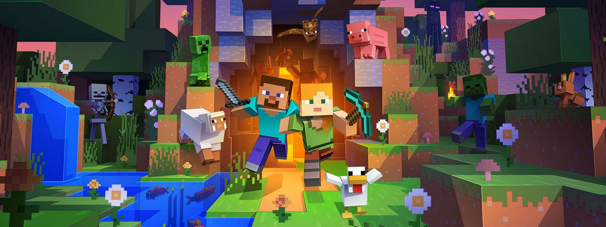

# Minecraft AFK Bots

Our farming locations are always working with these AFK bots. Once the config files are added to PM2, the bots are ready to run!

## Environment Variables

### `process.env.SERVER`

In order to connect to the server, you must enter its IP address.

### `process.env.NAME`

Ingame names can be given to your bot.

## Dependencies

- mineflayer